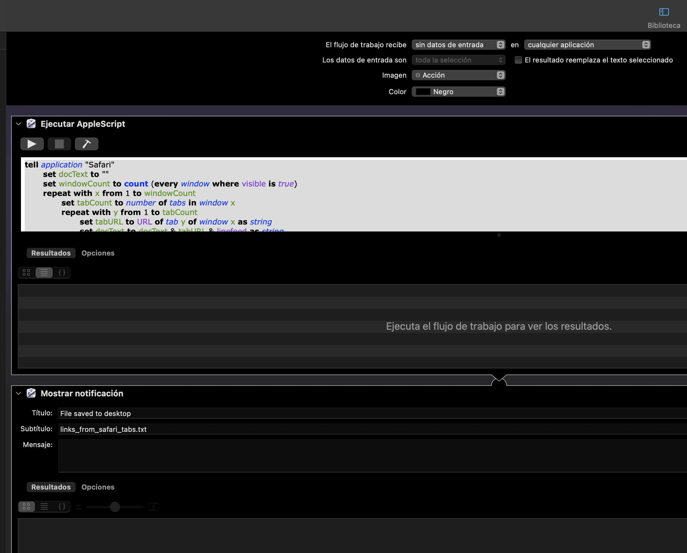
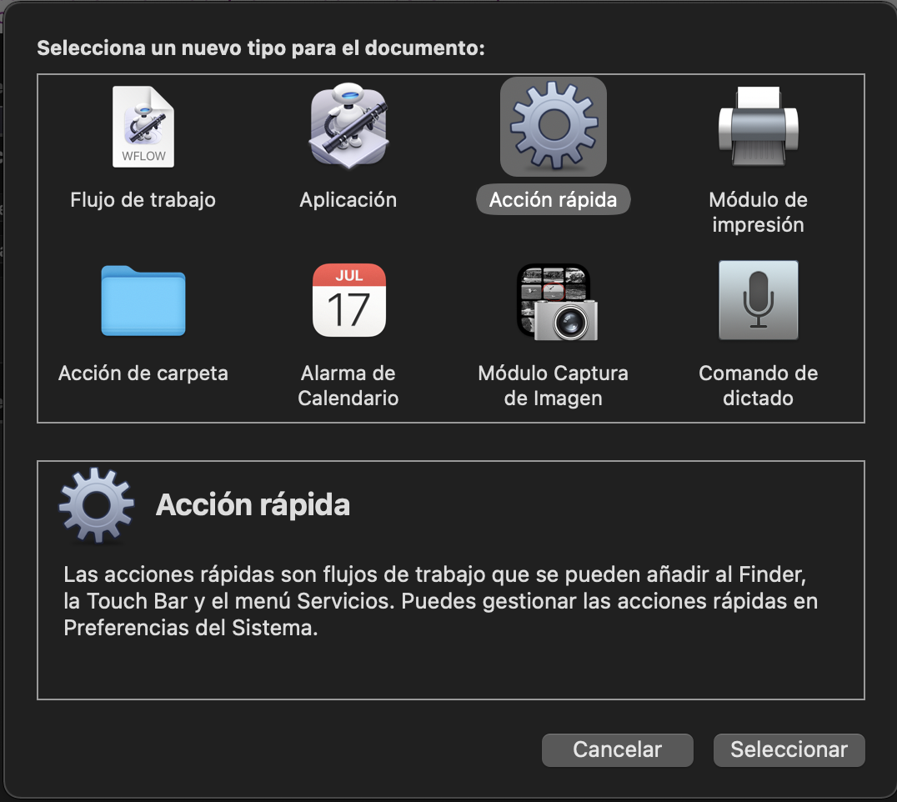

# applescript: get urls from safari tabs

This repo contains a MacOS to get all URLs from Safari tabs and store it to text file in your desktop.


**TLDR: **
```applescript
tell application "Safari"
	set docText to ""
	set windowCount to count (every window where visible is true)
	repeat with x from 1 to windowCount
		set tabCount to number of tabs in window x
		repeat with y from 1 to tabCount
			set tabURL to URL of tab y of window x as string
			set docText to docText & tabURL & linefeed as string
		end repeat
		do shell script "echo " & docText's quoted form & "> $HOME/Desktop/links_from_safari_tabs.txt"
	end repeat
end tell
```

Using Automator (thanks Apple for that amazing tool 😉) I created a service that includes a notification:




Saved as "fast action" to get a service:


